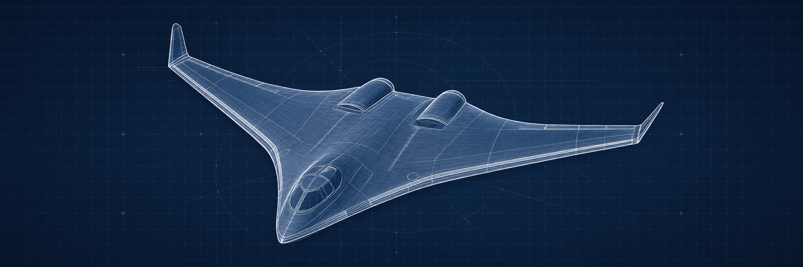
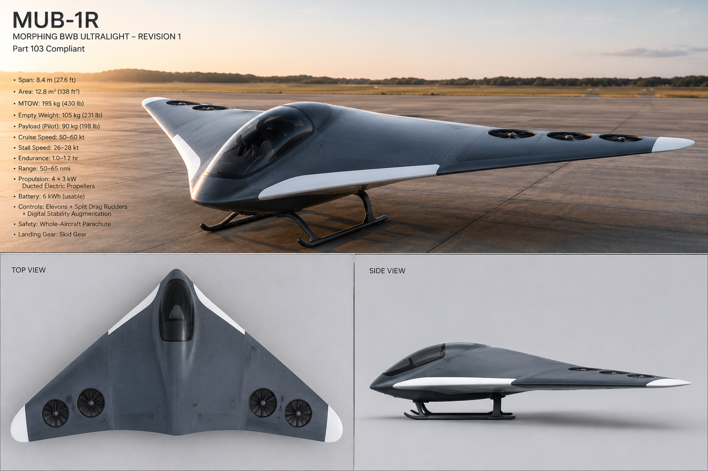

<p align="center">
  
</p>

<h1 align="center">MUB-1R</h1>
<h3 align="center">Morphing BWB Ultralight — Revision 1</h3>
<p align="center">
  <em>A phase-gated, all-electric, Part 103 blended wing body flying wing</em>
</p>

<p align="center">
  <a href="https://mub-1r.com"></a>
  <a href="LICENSE"></a>
  <a href="https://shields.io/img/logo.png"></a>
</p>

<p align="center">
  
  
  
  
  
</p>

---

## About

**MUB-1R** is an open-hardware, all-electric blended wing body (BWB) ultralight aircraft designed to comply with **FAR Part 103** — no pilot certificate, no aircraft registration, no medical required.

This repository contains the **project showcase and investor website** for the MUB-1R program. The site serves as the single source of truth for program specs, roadmap, risk posture, and partnership opportunities.

> _"The airplane is the test article. The data is the product."_

<p align="center">
  
</p>

---

## Aircraft Specifications

| Parameter | Value |
|---|---|
| **Class** | FAR Part 103 — no certificate, no registration |
| **Configuration** | Swept tailless flying wing, 3-module |
| **Span / Area / AR** | 10.4 m / 19.5 m² / 5.5 |
| **Empty / MTOW** | 115 kg / 210 kg |
| **Stall / Cruise** | 24 kt / 50–60 kt |
| **Propulsion** | 2× 10–12 kW leading-edge outrunner motors |
| **Battery** | 4.6 kWh, 16S Li-ion, dual redundant packs |
| **Controls** | Elevons + split drag rudders + digital stability augmentation |
| **Endurance** | ~1.0–1.2 hr at cruise |
| **Range** | 50–65 nmi |
| **Safety** | Whole-aircraft parachute, skid gear |
| **Load Limits** | +4.4g / −2.2g limit · 6.6g ultimate (×1.5) |
| **Airframe Cost** | ~$9,900 incl. tooling and contingency |

---

## Program Architecture

The MUB-1R program uses a **two-track discipline**:

```
┌─────────────────────────────────────────────────────┐
│                    TRACK A — Aircraft                │
│  Phase 0 → 1A → 1B → 1C → 1D → 1.5 → 2 → 3       │
│  (Foundation → Build → Fly → Solar → Soar)          │
│  Every phase has a quantified exit gate              │
└─────────────────────────────────────────────────────┘
                         │
                         │ feeds data to
                         ▼
┌─────────────────────────────────────────────────────┐
│               TRACK B — Technology Gates             │
│  Rib-pack energy · BLI duct rig · SMA morphing      │
│  Parallel, optional, as-funded                       │
│  Pass/fail gates — on fail, conventional stands      │
└─────────────────────────────────────────────────────┘
```

### Phase-Gated Roadmap

| Phase | Title | Cost | Duration | Exit Gate |
|---|---|---|---|---|
| **0** ✅ | Foundation | $1,400 | 6–8 wks | Model flies predictably; coupon tests pass |
| **1A** | Cockpit Cell + Center | $2,200 | 8–10 wks | Static load proof test (4.85g equiv., 3-min hold) |
| **1B** | Wings, Controls, Gear | $2,800 | 10–12 wks | Rigging + weight audit ≤ 115 kg |
| **1C** | Propulsion + Avionics | $3,000 | 4–6 wks | Full-power ground run; W&B in CG box |
| **1D** | Flight Test Campaign | $500 | 8–12 wks | 10 hr envelope logged; cruise power known |
| **1.5** | Ground Solar | $2,000 | parallel | Measured cruise power known |
| **2** | Airborne Solar | $3–4.5k | 8 wks | Coupon thermal pass; cruise ≤ 5.5 kW |
| **3** | Soaring Operations | $1,200 | 6 wks | Cross-country capable |
| **B** | Track B Tech Gates | $2–3k | as-funded | Quantified pass/fail per Rev B |

---

## Website Architecture

```
nextjs_space/
├── app/
│   ├── layout.tsx          # Root layout, fonts, GA, metadata
│   ├── page.tsx            # Homepage (single-page sections)
│   ├── pitch-deck/
│   │   └── page.tsx        # 4-act web-native pitch deck
│   └── api/
│       └── contact/
│           └── route.ts    # Contact form → PostgreSQL
├── components/
│   └── site/
│       ├── header.tsx      # Fixed nav with mobile menu
│       ├── hero.tsx        # Animated hero with specs
│       ├── mission.tsx     # 6-pillar design philosophy
│       ├── technical.tsx   # Specs, weight chart, structural margins
│       ├── roadmap.tsx     # Phase-gated timeline + Track B gates
│       ├── risk.tsx        # Risk matrix + skeptic Q&A
│       ├── investment.tsx  # Partnership tiers
│       ├── contact.tsx     # Contact form
│       ├── footer.tsx      # Site footer
│       ├── charts.tsx      # SSR-safe weight & risk charts
│       └── shared.tsx      # CountUp, FadeIn, SectionHeading
├── lib/
│   ├── data.ts             # Single source of truth for all specs
│   ├── db.ts               # Prisma client
│   └── utils.ts            # Utility functions
├── prisma/
│   └── schema.prisma       # ContactSubmission model
└── public/
    └── images/             # Aircraft renders, OG images
```

### Pages

| Route | Description |
|---|---|
| `/` | Main single-page site — Hero, Mission, Technical, Roadmap, Risk, Investment, Contact |
| `/pitch-deck` | Web-native 4-act partner pitch deck |
| `/api/contact` | POST endpoint for contact form submissions |

---

## Tech Stack

| Layer | Technology |
|---|---|
| **Framework** | Next.js 14 (App Router) |
| **Styling** | Tailwind CSS + custom CSS variables |
| **Animations** | Framer Motion |
| **Charts** | Recharts (with SSR-safe CSS fallbacks) |
| **Database** | PostgreSQL via Prisma ORM |
| **Fonts** | DM Sans · Plus Jakarta Sans · JetBrains Mono |
| **Analytics** | Google Analytics 4 (GA4) |
| **Icons** | Lucide React |
| **Language** | TypeScript (strict) |

---

## Getting Started

### Prerequisites

- **Node.js** ≥ 18.x
- **Yarn** (package manager)
- **PostgreSQL** database (local or hosted)

### Installation

```bash
# Clone the repository
git clone https://github.com/your-username/mub-1r.git
cd mub-1r/nextjs_space

# Install dependencies
yarn install

# Set up environment variables
cp .env.example .env
# Edit .env with your database URL and optional GA Measurement ID

# Generate Prisma client
yarn prisma generate

# Push database schema
yarn prisma db push

# Start development server
yarn dev
```

The site will be running at `http://localhost:3000`.

### Environment Variables

| Variable | Required | Description |
|---|---|---|
| `DATABASE_URL` | ✅ | PostgreSQL connection string |
| `GA_MEASUREMENT_ID` | ❌ | Google Analytics 4 Measurement ID (e.g., `G-XXXXXXXXXX`) |

---

## Design Decisions

### SSR-Safe Rendering

All numerical counters and charts render real data in the initial server-rendered HTML — no "Loading..." or "0.0" states. This ensures:
- Crawlers and link previews see actual content
- No flash of empty state on first paint
- Accessibility for users with JavaScript disabled

### Two-Track Discipline

The website mirrors the aircraft program's two-track structure:
- **Track A** (aircraft build) has sequential phase gates with quantified exit criteria
- **Track B** (technology experiments) runs in parallel with pass/fail gates — on fail, conventional solutions stand

### Dark Theme

The site uses a premium dark aerospace aesthetic with a custom CSS variable system. The color palette centers on `#60B5FF` (primary accent) against deep navy/charcoal backgrounds.

---

## Contributing

We welcome contributions! Please read our [Contributing Guide](CONTRIBUTING.md) for details on:
- Code style and conventions
- How to submit pull requests
- Issue reporting guidelines

See also:
- [Code of Conduct](CODE_OF_CONDUCT.md)
- [Security Policy](SECURITY.md)

---

## Project Status

**Phase 0 — Foundation** is actively underway. The program is past concept and into physical build.

| Milestone | Status |
|---|---|
| Workshop setup | ✅ Complete |
| Hot-wire cutter build | ✅ Complete |
| Process coupons | 🔄 In Progress |
| 1/4-scale flying model | 🔄 In Progress |
| Website launch | ✅ Live at [mub-1r.com](https://mub-1r.com) |

---

## License

This project is licensed under the **MIT License** — see the [LICENSE](LICENSE) file for details.

---

## Contact

**J Manchester** — Founder & Chief Engineer

For partnership inquiries, technical questions, or general interest, please use the [contact form on the website](https://mub-1r.com/#contact).

---

<p align="center">
  <sub>Built with precision. Tested with rigor. Open by design.</sub>
</p>
